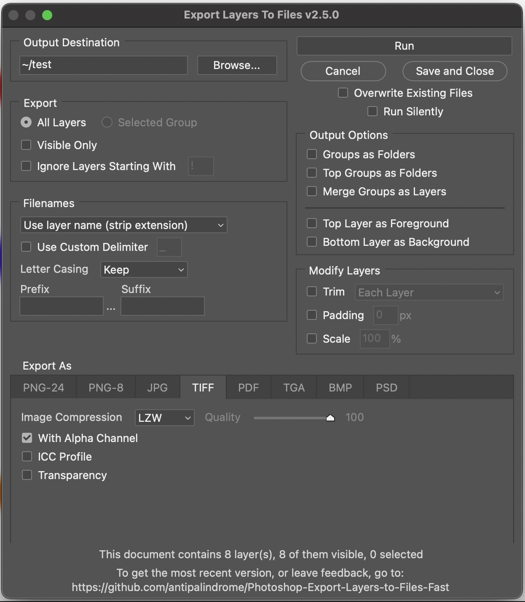

# Photoshop-Export-Layers-to-Files-Fast
Photoshop-Export-Layers-to-Files-Fast 2023

## How to Use

_Disclaimer:_ We are not associated with Adobe in any way. For any issues relating to Adobe products or Adobe scripts please contact them directly. We have never had an issue, but **please use this script at your own risk**. We are not responsible for any lost data or damaged PSDs so always make a back-up.

- Go to the [releases page](https://github.com/antipalindrome/Photoshop-Export-Layers-to-Files-Fast/releases) and download [the most recent release](https://github.com/antipalindrome/Photoshop-Export-Layers-to-Files-Fast/releases/latest).
- In Photoshop go to `File -> Scripts -> Browse...` and select the `Export Layers To Files (Fast).jsx` file.
  - NOTE: The script needs the `Export Layers To Files (Fast)-progress_bar.json` file to run as well. Without this you will get a "Progress bar resource corrupt" error. Please ensure that the `.jsx` and the `.json` files are siblings in the same directory.
- You can add the script to the Scripts menu by adding all of the script files to `Photoshop > Presets > Scripts`
  - Windows: `/Program Files/Adobe/Adobe Photoshop VERSION/Presets/Scripts`
  - Mac: `/Applications/Adobe Photoshop VERSION/Presets/Scripts`

## Example Screenshot

